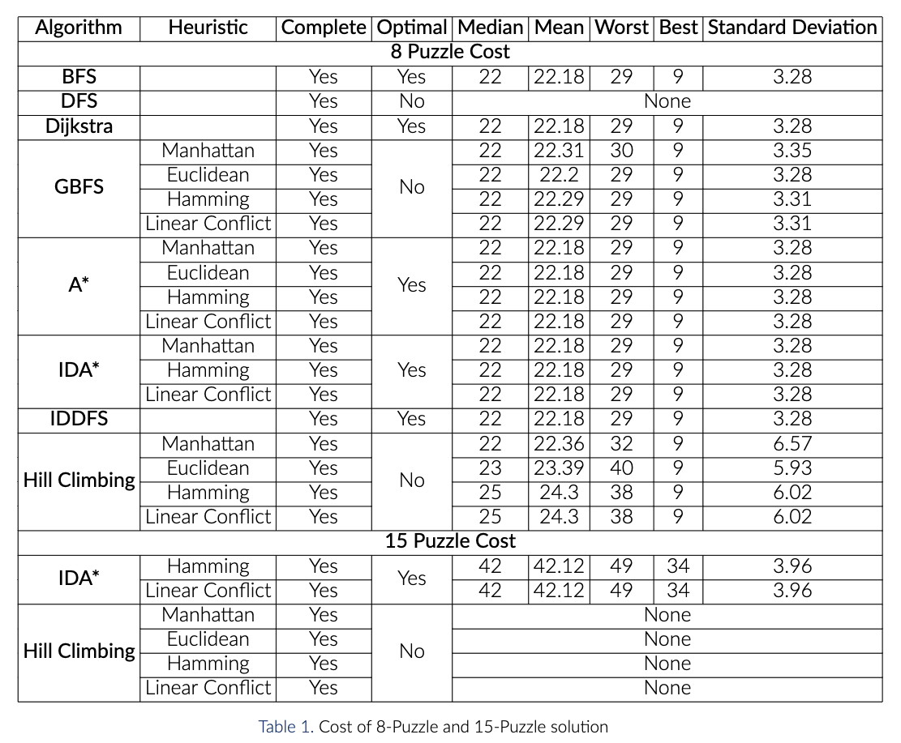
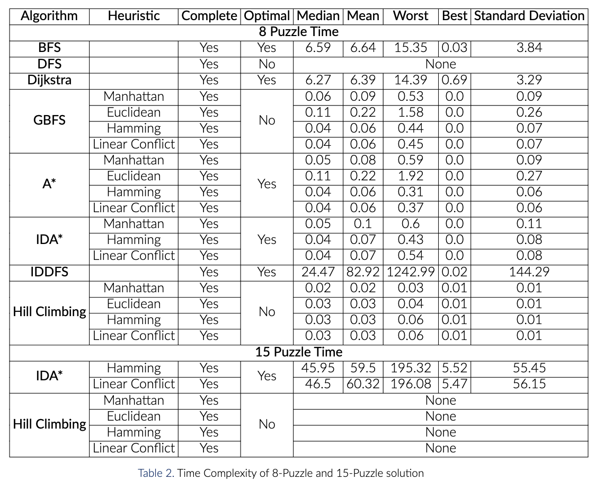

# N-Puzzle Solver
The goal of this work is to explore and analyze different search strategies and compare the runtime, cost, completeness, and optimality. Three types of search strategies are implemented. These are Uninformed search, Informed Search, and Local Search. Under the Uninformed search, we have implemented Breadth-First Search(BFS), Depth-First Search (DFS), Iterative Deepening DFS, and Dijkstra’s algorithm. Similarly, we have implemented Best-First Search, A* Algorithm, and Iterative Deepening A* as informed searches. Also, Hill Climbing Search is implemented as Local Search

## Backgrounds
The puzzle was invented by Noyes Palmer Chapman. There is an initial state and goal state of this puzzle. Different types of search strategies are used. These strategies are evaluated based on completeness, Admissibility, Time complexity, and Space complexity. To understand the problem and the solving techniques some background pieces of knowledge are described below:

- **Completeness**: An algorithm is complete if it can find the solution when a solution exists.
- **Admissibility**: If a solution is found, it is guaranteed to be optimal.
- **Time Complexity**: It calculates the worst or average case. Usually measured by the number of nodes expanded.
- **Space Complexity**: Usually measured by the maximum size of graph/tree during the search

## Search Strategies
1. Breadth-First Search (BFS)
2. Depth-First Search (DFS)
3. Iterative Deepening Depth-First Search (IDDFS)
4. Dijkstra’s algorithm
5. Greedy Best First Search
6. A*
7. Iterative Deepening A* (IDA*)
8. Hill climbing Search

## Results and Analysis:
We have solved the 8-Puzzle problem and the 15-Puzzle problem. For the dataset, 1000 mixed board configuration of the 8-Puzzle problem has been used. Here, path cost is also included. To solve the 15-Puzzle problem, 100 mixed board configuration has been used. We have included the cost and timetable for all the algorithms implemented. We have included the parameters median, mean, best, worst and standard deviation. The tables provide a detailed analysis of the implemented algorithms. Apart from cost and time, we have also found out the parameters for the number of nodes expanded for both 8 and 15 puzzle problems.

### Cost

### Time

## Limitations
In 15-Puzzle, with more than 50 steps, is too long to solve even with pruning and heuristics. It will have 6.3 ∗ 1058 states w/o any pruning. We were not able to get the cost of 15 puzzle problem for hill climbing, even after considering 4 heuristics in addition to DFS for 8 puzzle problem.

## Conclusion
We have implemented 8 and 2 algorithms for 8 and 15 puzzle problems, respectively. According to the cost tables, out of all the algorithms implemented BFS, Dijkstra, A*, IDA* and IDDFS have minimal cost and low standard deviation in comparison to the other algorithms that have been implemented for the 8 puzzle problem. And because these algorithms are also optimal, we conclude that they are a promising approach for the 8 puzzle problem.

## Reading Resources:
* https://cdmana.com/2021/01/20210127193912645m.html
* https://stackoverflow.com/questions/52792260/python-15-puzzle-solver-with-a-algorithm-cant-find-a-solution-for-most-cases
* https://github.com/KHvic/uva-online-judge/blob/master/10181-15-Puzzle%20Problem.cpp?fbclid=IwAR0gwJ87ZYIkBl_DDnAcl9Ed5VwOAGl_htbK2fwK4XfwGUFTHtY0PEj_hiY
* [Is Solvable Strategy](https://www.geeksforgeeks.org/check-instance-15-puzzle-solvable/) 
* https://en.wikipedia.org/wiki/Iterative_deepening_depth-first_search
* https://en.wikipedia.org/wiki/Iterative_deepening_A*
* [Hill Climbing](https://towardsdatascience.com/solve-slide-puzzle-with-hill-climbing-search-algorithm-d7fb93321325)
* https://algorithmsinsight.wordpress.com/graph-theory-2/a-star-in-general/implementing-a-star-to-solve-n-puzzle/
* https://www.geeksforgeeks.org/n-queen-problem-local-search-using-hill-climbing-with-random-neighbour/
* [Linear Conflict](https://medium.com/swlh/looking-into-k-puzzle-heuristics-6189318eaca2)
* https://www.cs.usfca.edu/~galles/visualization/Algorithms.html
* https://qiao.github.io/PathFinding.js/visual/
* https://redirect.cs.umbc.edu/courses/graduate/671/fall21/notes/04_search1/
* https://redirect.cs.umbc.edu/courses/graduate/671/fall21/notes/05_search2/
